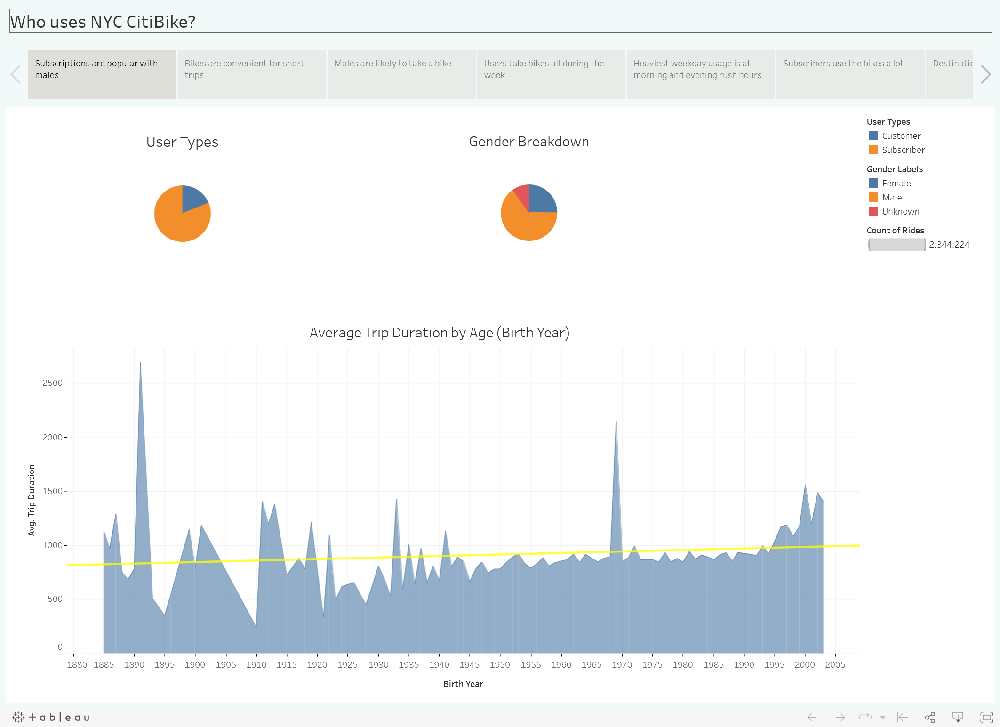
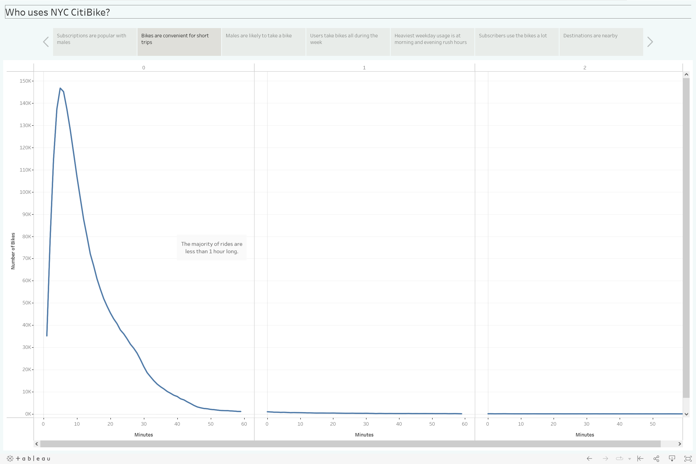
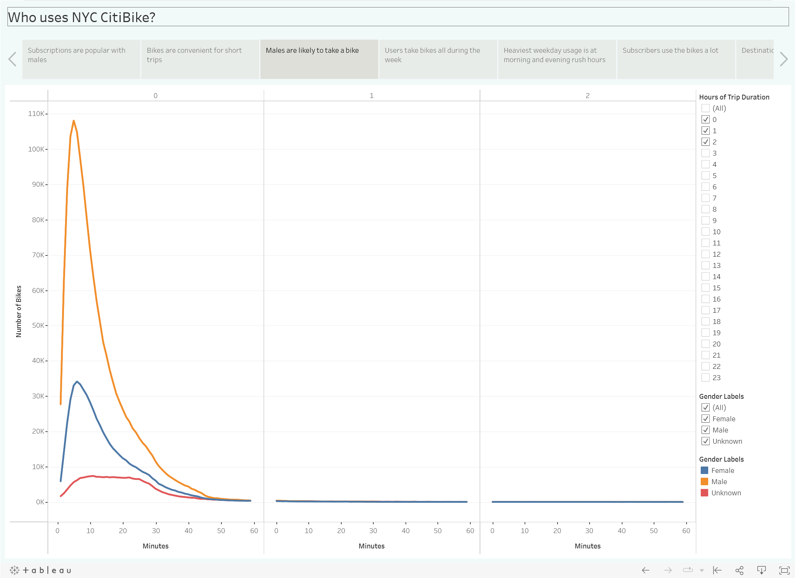
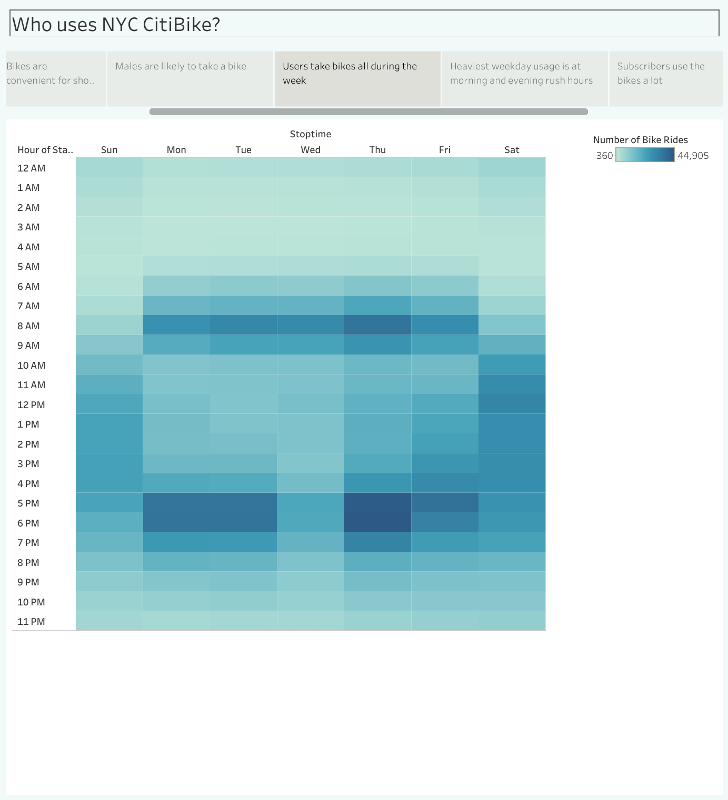
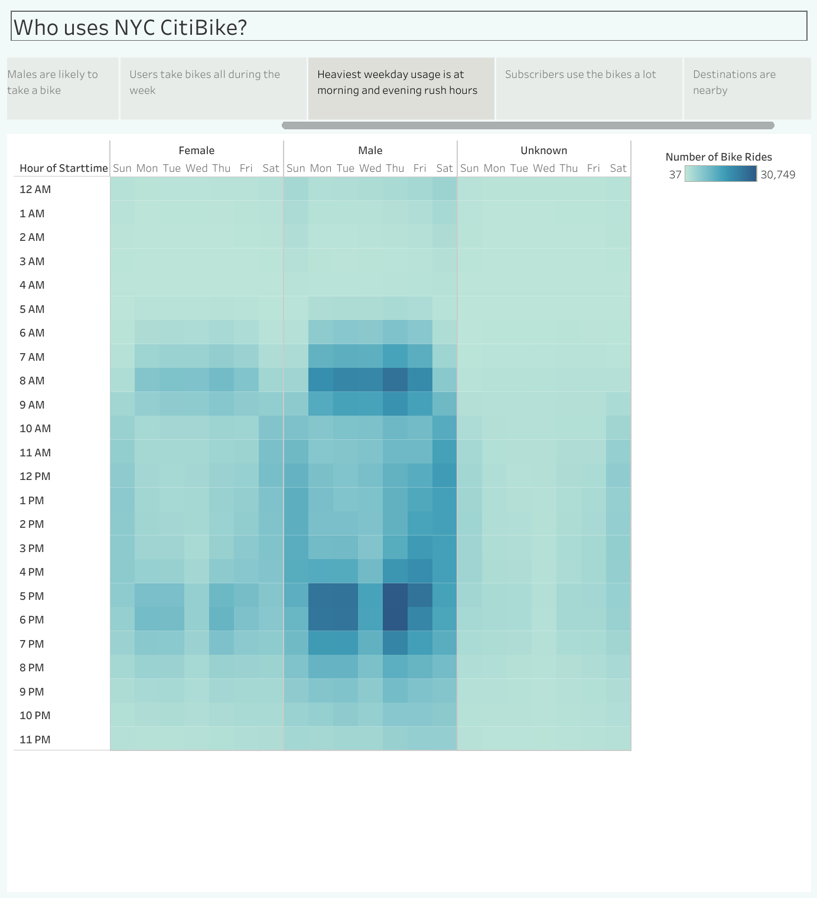
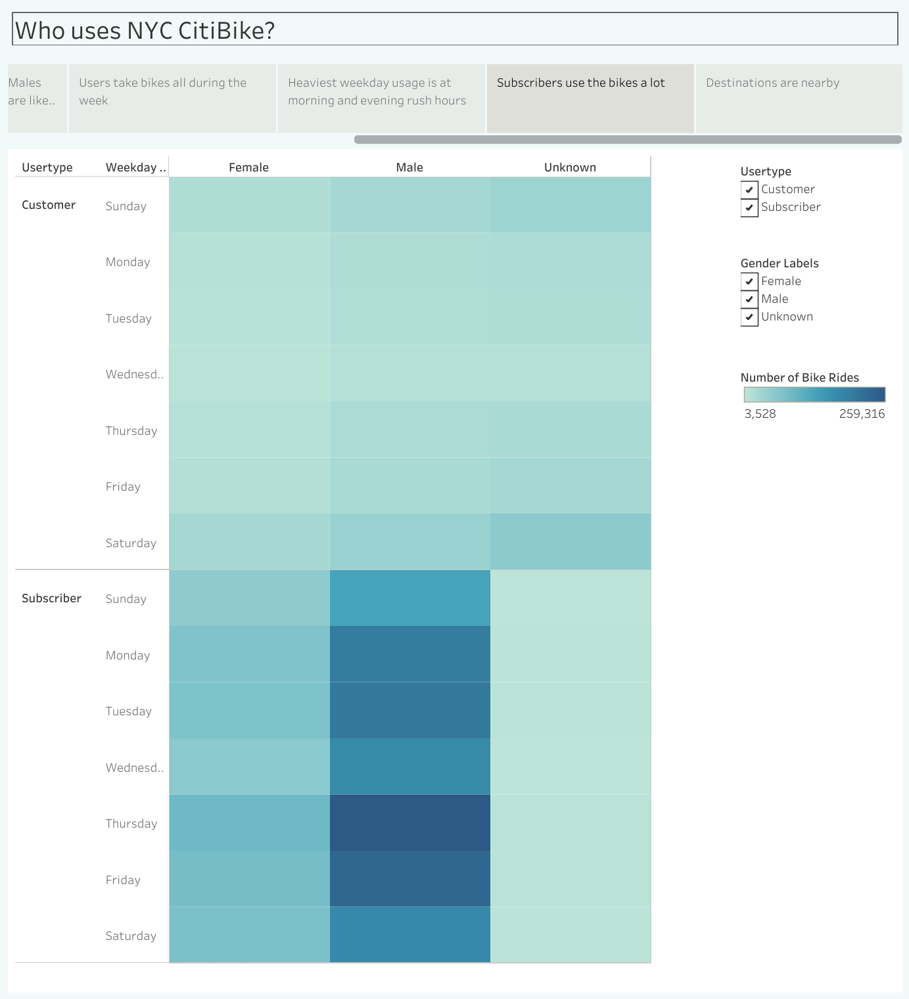
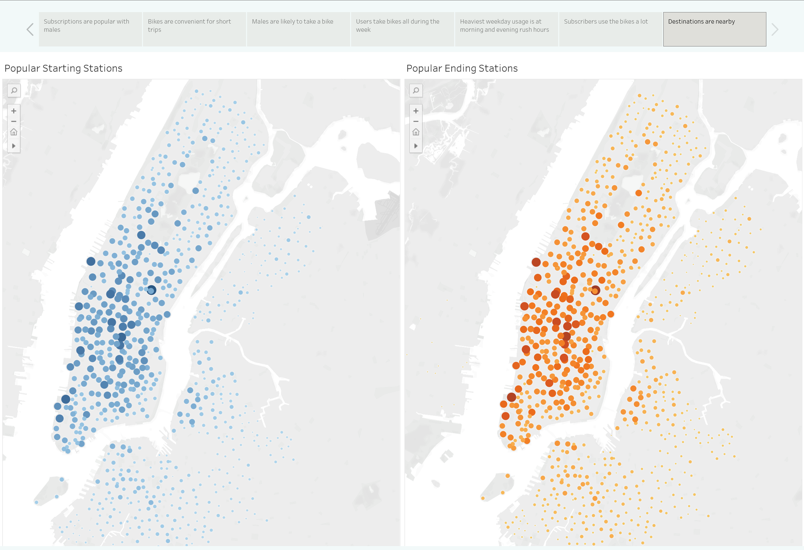
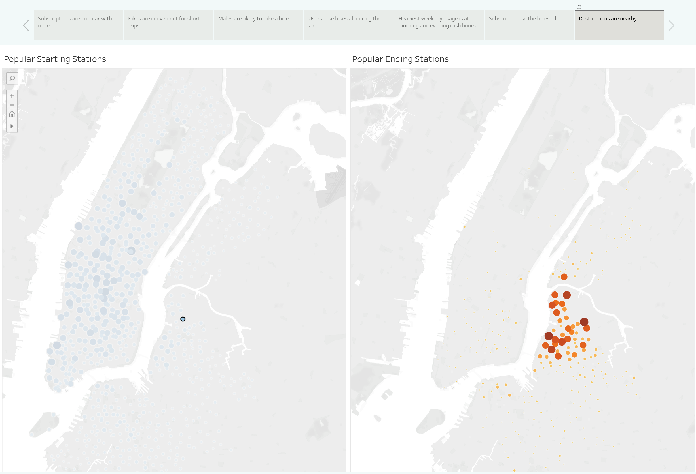

# NYC Bike-Sharing with CitiBikes
## Overview of the Analysis
This project documented an analysis of data from NYC CitiBikes.  Using data from August 2019, visualizations were created to expose findings within the user population.  The visualizations were assembled into a Tableau story for publication.

The analysis focused on the demographics of the user population.  Their age, gender, and whether they were a subscription holder, or a casual customer.

## Technology
This project included the following technologies:
* Tableau Public - Data exploration and visualization platform
* Pandas - Python library for working with data.  For this project it was within a DataFrame.
* Jupyter Notebook - The Jupyter Notebook is a web-based interactive computing platform that was used for developing Python code and transforming the data used within Tableau.

## Analysis Process
The raw data contains ride duration data in Seconds (integer format).  In order to be able to create the desired visualizations, the duration data needed to be converted into date-time values.  This activity was completed with the use of Jupyter Notebook, Pandas, and Python.

After the duration data was converted, the dataset was exported from Jupyter Notebook into a new CSV file, and this file was then input into Tableau Public, to being building the visualizations.

## Results

#### Tableau Public Presentation
The published presentation is available via this link: 

[Link to Dashboard](https://public.tableau.com/app/profile/andrew.zinc/viz/NYCCitiBike_16668175975740/NYCBikeSharing)

#### Demographics
The analysis reveals that the majority of users are Male, and subscribers.  With a view of user age and riding duration, we see that younger users ride longer.

The trend line will recalculate when data is selected to show the trend for a portion of the data.  Making a selection from approximately 1975 onwards, reveals a sharply rising trendline - indicating rides of longer duration.

#### Frequency vs. Trip Duration
A line chart was plotted to examine any patterns in the riding time.  From the plotted line, we see that the majority of riders are on their bikes for less than 1 hour.  There is a long tail outward as riders infrequently keep their bikes for several hours.

#### Gender Frequency vs. Trip Duration
This plot indicates that there is large male population within the ridership.

#### Weekly Usage by Hours
This heat map shows the weekly activity and reveals that the workday usage is concentrated at the morning and evening commuting times, which suggests that a primary use of this service is for daily commuting.  Interestingly, there is a Wednesday lull that is evident over the entire day, but is most visible in the evening commuter hours.

#### Weekly Usage by Gender and Hours
The system usage was further explored by examining the weekly usage by gender for each hour of the day.  We see that the Wednesday lull is visible across all gender labels.  We also see that male usage dominates the weekly activity.

#### Weekly Usage by CustomerType and Gender
A final heat map was constructed to compare the weekly usage of Subscribers and casual Customers, across all gender labels.  We can see that male subscribers exhibit the most prevalent usage patterns, followed by female subscribers.

#### Station Utilization
This analysis concluded with visualization of the frequency of station usage as a measure of popularity.  When comparing the map of stations, it appears that the starting and ending bike stations are equally popular.

#### Station Filtering
An interesting aspect of the starting and ending station dashboard, is the ability to filter the ending station based on a specific starting station.  From this, we can see that the most frequent ending locations are relatively close by.

## Conclusions
The analysis reveals the possibility that many NYC males are using the bike-sharing service for commuting to work locations.  There is an oddity in the weekly usage where ridership drops on Wednesdays, particularly in the afternoon and evening hours.

Additional visualizations are suggested for future analysis in the areas of:
* Subscriber types - sight-seers vs. commuters?
* What happens on Wednesdays?
